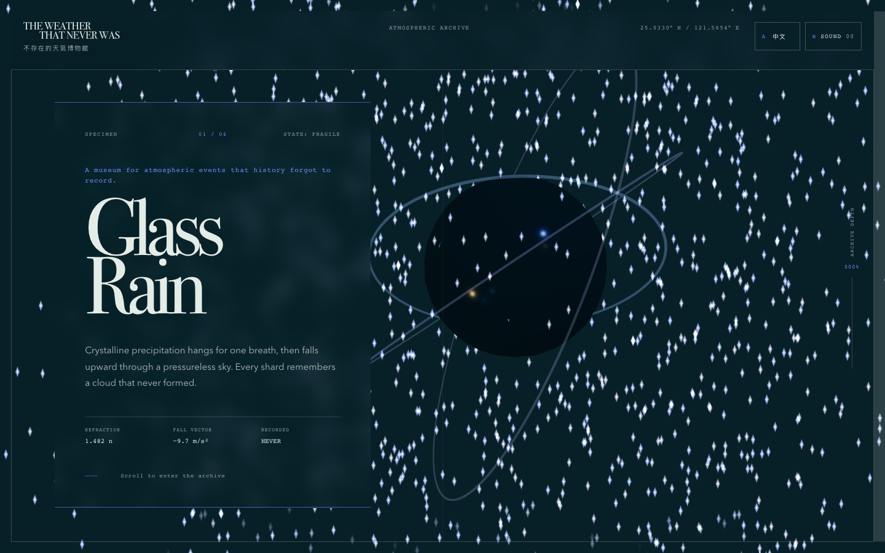
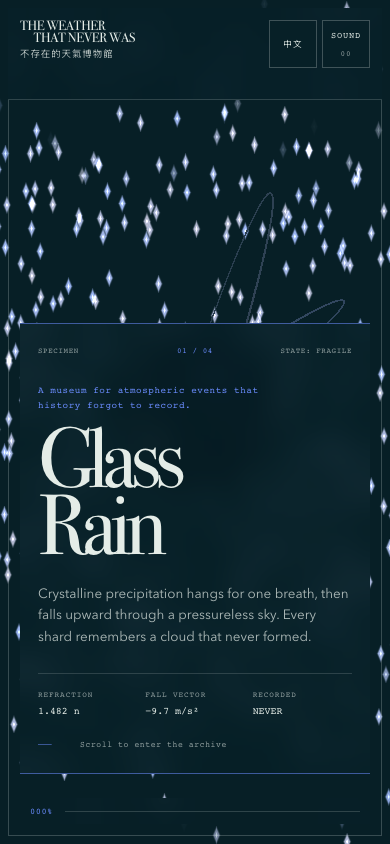
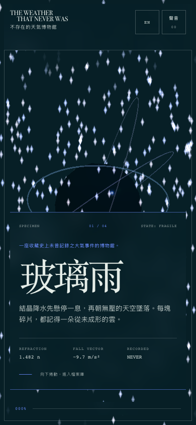

# THE WEATHER THAT NEVER WAS

一座收藏「從未發生過的天氣」的互動博物館。四種虛構大氣標本由 Three.js 即時生成，搭配雙語策展文字、原生 Web Audio 聲場與可調式研究終端。



## 體驗內容

- 四個即時 3D 標本：玻璃雨、磁霧、逆閃電、潮汐極光
- 自訂 GLSL 粒子材質、半透明氣象冷凝器、軌道與程序式閃電／極光
- 英文／繁體中文切換
- 預設關閉、由使用者手勢啟動的生成式 Web Audio 聲場
- 密度、湍流與光譜三個即時參數
- 目前畫面 PNG 保存
- 桌機、平板、手機 RWD；無 WebGL 與減少動態模式都有可用替代路徑

## 執行

```bash
npm install
npm run dev
```

正式建置：

```bash
npm run build
npm run preview
```

鍵盤可用 `Alt + 方向鍵` 前後切換展品。聲音必須由使用者點擊啟動，不會自動播放。

## 驗收快照

| 項目 | 結果 |
|---|---|
| Vite production build | PASS |
| npm audit | 0 vulnerabilities |
| WebGL | Chrome headless 實測 WebGL 2.0 |
| JavaScript／shader runtime | 0 page errors、0 shader compile errors |
| 1440 × 900 | 無橫向溢出 |
| 820 × 1180 | 無橫向溢出 |
| 390 × 844 | 無橫向溢出、控制 48 px |
| 語言／模式／參數／聲音 | PASS |
| PNG capture | 有效 PNG，signature `89504e470d0a1a0a` |
| reduced motion | 閒置畫面靜止、換展品仍更新 |
| no-WebGL fallback | HTML 展覽、繁中切換仍可用 |

瀏覽器結果保存在 [browser-results.json](screenshots/browser-results.json) 與 [edge-results.json](screenshots/edge-results.json)。

<p>
  
  
</p>

## 本地模型 Pair Programming

所有被委派的設計、coding 與視覺審查角色都只透過本地 Ollama 執行；沒有雲端子 agent。Codex 擔任規格、整合、驗收與失敗救場。

- 協作方法與角色：[COLLABORATION.md](COLLABORATION.md)
- 每一次模型表現、踩雷與修正建議：[LOCAL_MODEL_EVALUATION.md](LOCAL_MODEL_EVALUATION.md)
- 機器可讀紀錄：[collaboration/run-manifest.json](collaboration/run-manifest.json)

## 結構

```text
src/
  main.js          WebGL 能力偵測與生命週期
  weather-lens.js  Three.js 場景、GLSL、四種天氣
  sound.js         原生 Web Audio 聲場
  ui.js            捲動、語言、參數、擷取與無障礙互動
  styles.css       策展視覺系統與 RWD
collaboration/
  run-manifest.json
screenshots/
  browser-results.json
  edge-results.json
```
